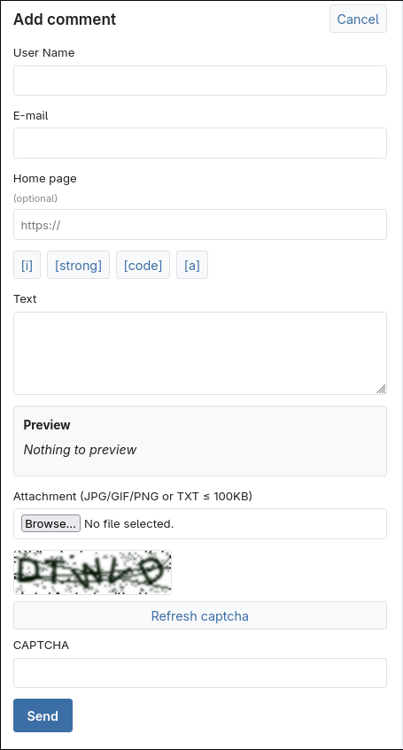
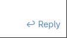
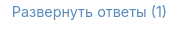
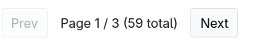

# SPA Comments

Учебное SPA-приложение комментариев (Django + Vue 3 + MySQL + Docker).

## Функции

- Добавление комментариев: имя, email, homepage (опц.), CAPTCHA, текст
- Разрешённый HTML (`a`, `code`, `i`, `strong`) с проверкой тегов; защита от XSS
- Вложения: JPG/GIF/PNG (ресайз ≤ 320×240) или TXT ≤ 100 KB, просмотр в lightbox
- Список корневых комментариев: сортировка (имя / email / дата), пагинация 25, LIFO по умолчанию
- Вложенные ответы (дерево), раскрытие ответов, форма ответа под комментарием
- Preview и панель тегов без перезагрузки страницы
- Live-обновление списка по WebSocket

## Интерфейс

**Добавить обсуждение** — открывает форму нового корневого комментария:


**Форма комментария** — имя, email, homepage (опц.), разрешённые HTML-теги, preview, вложение, CAPTCHA и отправка:



**Reply** — форма ответа прямо под выбранным комментарием:



**Развернуть ответы** — показывает/скрывает вложенные ответы (в скобках — их число):



**Пагинация** — по 25 корневых комментариев на страницу, Prev / Next и счётчик:



## Запуск с нуля

Нужны: Git и Docker Compose.

```bash
git clone https://github.com/Paiconys/SPA-dZEn.git
cd SPA-dZEn

cp .env.example .env
# Открой .env и заполни значения (минимум SECRET_KEY; для Docker
# DB_HOST=db и REDIS_URL=redis://redis:6379/0 уже подходят из примера).

docker compose up --build -d
```

Сайт: http://127.0.0.1:5173/  
API: http://127.0.0.1:8000/api/comments/

Остановка: `docker compose down`

Схема БД для MySQL Workbench: [`docs/schema.sql`](docs/schema.sql)

## E2E тесты

Стек должен быть уже запущен (`docker compose up -d`).

```bash
cd e2e
pip install -r requirements.txt
playwright install chromium
pytest
```
